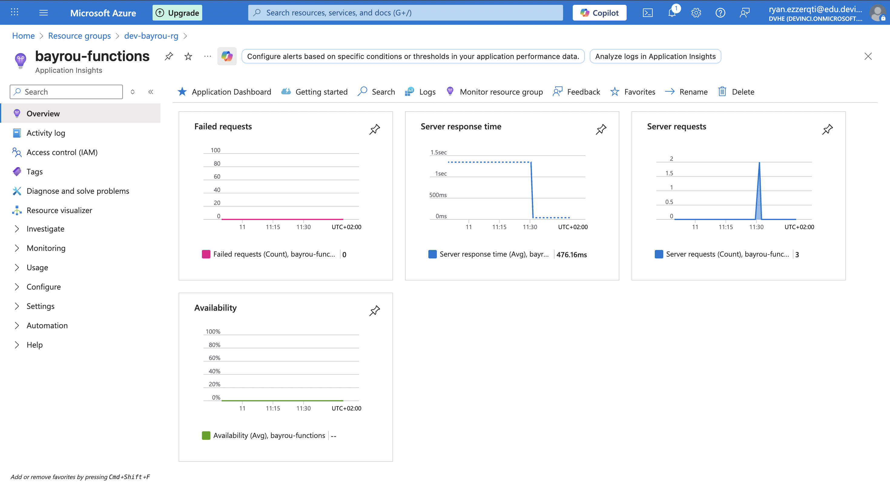

## Urls

Frontend link

```http
https://white-bay-076e50703.1.azurestaticapps.net/
```

Api link

```
https://bayrou-functions.azurewebsites.net/api/
```

#### Architecture

Le schema est divisé en 3 dossiers.

Le premier `api` contient l'api.

Le deuxieme `front` contient le projet en react.

Et le troisieme `.github` contient les workflows.

### Endpoints

GetUser

```http
https://bayrou-functions.azurewebsites.net/api/getUser?pseudo={pseudo}&email={email}
```

postUsers

```http
https://bayrou-functions.azurewebsites.net/api/postUser
```

Body: `email` `pseudo`

GetVotes

```http
https://bayrou-functions.azurewebsites.net/api/getVotes
```

postVote

```http
https://bayrou-functions.azurewebsites.net/api/postVote
```

Body: `vote` `email` `pseudo`

### Local

Run api

```bash
    cd api
    func start
```

Run front

```bash
  cd front
  npm run dev
```

### Screenshot KPI


